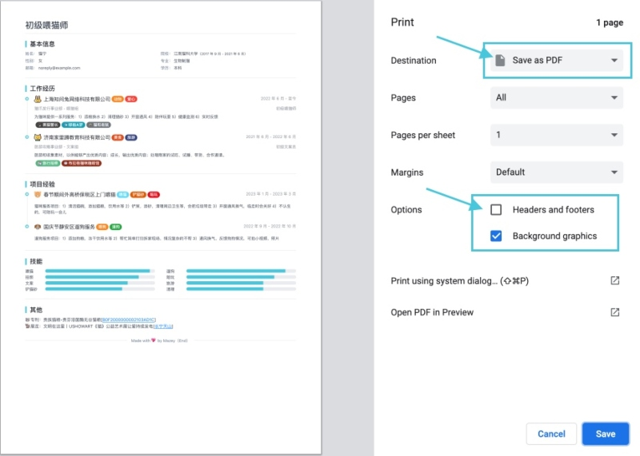
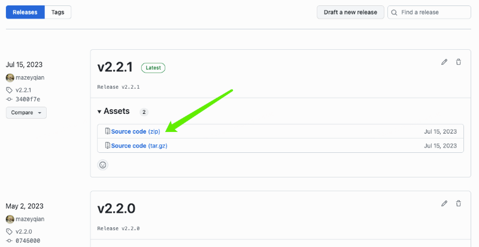

# json-to-resume

这是一个便捷的 JSON 转简历工具。

[预览](#预览) | [下载](#下载) | [使用指南](#使用指南) | [本地启动](#本地启动)

## 预览



演示地址：<https://i.mazey.net/x/resume/>

## 下载

进入 [Releases](https://github.com/mazeyqian/json-to-resume/releases) 页面下载最新版本：



## 使用指南

JSON 文件位于路径：`src/conf/resume.js`

| 字段 | 说明 | 示例 |
| :------------ | :------------ | :------------ |
| title | 简历标题 | 初级喂猫师 |
| pageAndFileName | 页面/文件标题 | 猫宁-初级喂猫师-2年 |
| personInfo | 个人信息 | - |
| personInfo.left | 个人信息 - 左边栏 | 姓名、性别 |
| personInfo.right | 个人信息 - 右边栏  |  院校、专业 |
| companies | 工作经历 | - |
| projects | 项目经验 | - |
| skills | 技能 | 喂猫、遛狗、拍照、旅游、铲猫砂 |
| others | 其他 | ⾃我总结、个人优势、职业资格 |

## 本地启动

Install dependencies:

```bash
npm install
```

Serve with hot reload:

```bash
npm run dev
```

Build for production:

```bash
npm run build
```

## License

This software is released under the terms of the [MIT license](https://github.com/mazeyqian/json-to-resume/blob/main/LICENSE).
